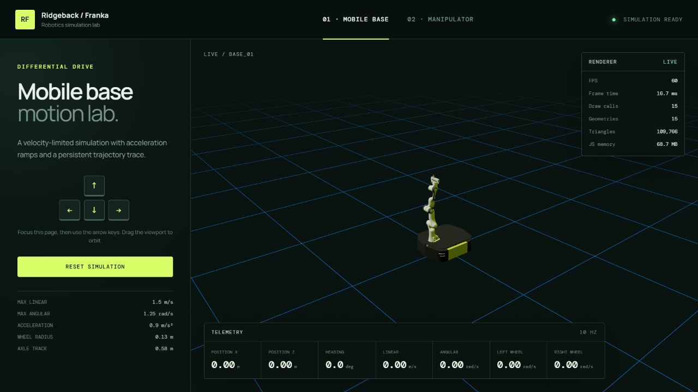
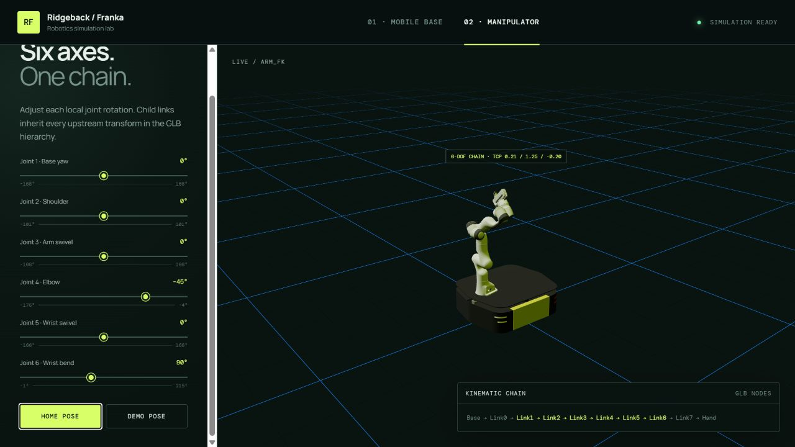
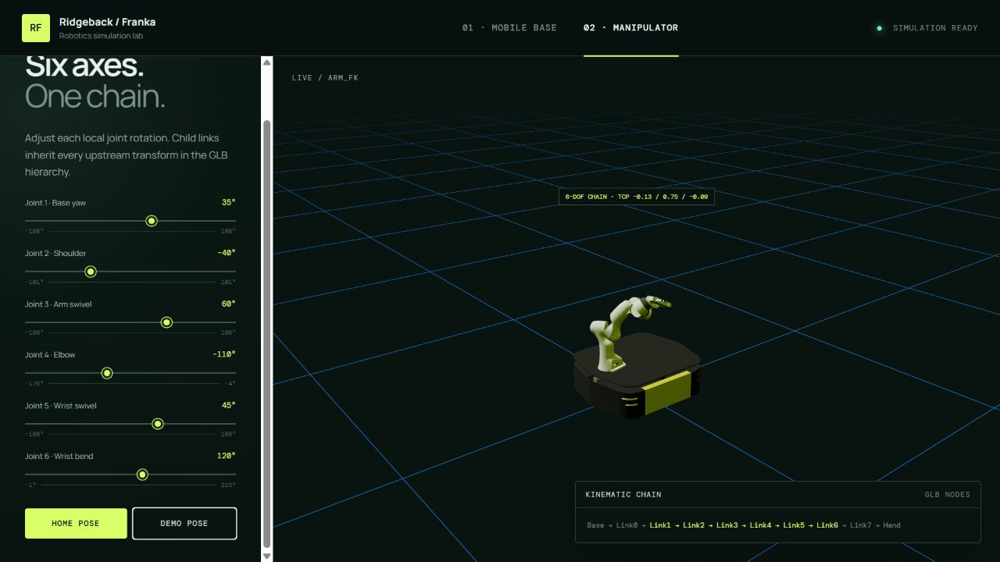
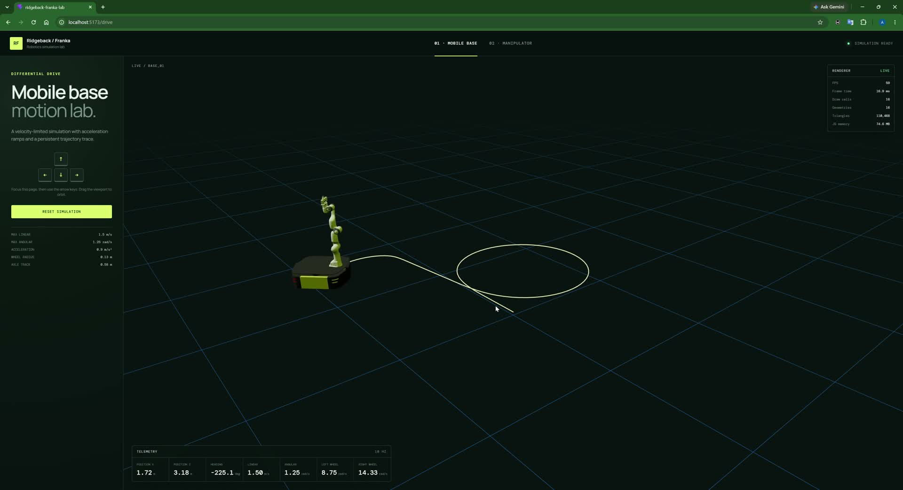

# Ridgeback / Franka Robotics Lab

Interactive React + Three.js demonstration using the supplied `ridgeback_franka.glb`.

## Features

- Differential-drive controls with keyboard and touch input, velocity limits, acceleration ramps, camera follow, trail, telemetry, and renderer statistics.
- Physical left/right wheel angular velocities derived from wheel radius and axle track.
- Validated seven-joint forward-kinematics controls and a centered 0–150 mm model-calibrated gripper using the GLB's preserved node hierarchy.
- Responsive two-page interface with orbit controls.
- Pure, unit-tested drive integration logic.
- Design notes for [emergency stopping](docs/EMERGENCY_STOP.md) and [instancing](docs/INSTANCING.md).
- A measured [performance review](docs/PERFORMANCE.md) with baseline and optimized results.
## Screenshots

### Mobile base simulation



### Manipulator forward kinematics

| Home pose | Demo pose |
| --- | --- |
|  |  |

The demo pose changes all seven joint values, opens the gripper, and updates the displayed TCP world position.

## Video demo

[](docs/video/ridgeback-franka-demo.mp4)

[Watch or download the 65-second MP4 demo](docs/video/ridgeback-franka-demo.mp4). It demonstrates keyboard-controlled base motion, live telemetry and renderer metrics, a figure-eight trajectory trail, navigation to the manipulator page, manual joint-slider changes, and TCP updates. The repository copy is compressed to 1920 × 1044 and intentionally contains no audio. For an alternative narrated submission recording, follow the [video recording checklist](docs/DEMO_VIDEO.md).

## Run locally

```bash
npm install
npm run dev
```

Open `http://127.0.0.1:5173/#/drive`. Hash-based routing and relative asset paths keep both simulation routes compatible with static hosting.

Quality checks:

```bash
npm test
npm run lint
npm run build
```

The JS heap metric is only exposed by browsers that implement `performance.memory` (primarily Chromium); other browsers display `N/A`.

## Extending the simulation

- Change velocity, acceleration, wheel radius, or axle-track parameters in `src/lib/drive.ts`. Keep the motion equations pure and add matching cases to `src/lib/drive.test.ts`.
- Add or adjust manipulator joints in `src/config/joints.ts`. Each entry maps a GLB node name to its local rotation axis and slider limits.
- Extend model behavior in `src/components/RobotModel.tsx`. Preserve the original rest quaternions and GLB parent/child hierarchy so joint rotations do not accumulate or detach child links.
- Add shared lights, controls, or scene helpers in `src/components/World.tsx`.
- Add a simulation page under `src/pages`, then register its lazy route and top-navigation link in `src/App.tsx`.
- When replacing the source GLB, run `npm run optimize:model`, verify that `Link1` through `Hand` still exist, and test both routes before committing the optimized asset.

Prefer extracting new calculations into framework-independent functions. This keeps the WebGL components focused on rendering and makes the behavior straightforward to unit-test without a browser.

## Differential-drive model

The operator commands a linear velocity `v` and yaw rate `ω`. The simulation ramps both commands with acceleration limits, converts them into wheel angular speeds, and then integrates the recovered base twist:

```text
leftWheel  = (v - ω × track / 2) / radius
rightWheel = (v + ω × track / 2) / radius
v          = radius × (rightWheel + leftWheel) / 2
ω          = radius × (rightWheel - leftWheel) / track
```

Current demo parameters are a `0.13 m` wheel radius and `0.58 m` axle track. Wheels are intentionally not rendered because the assessment model omits them, but both wheel speeds are shown in telemetry.

## Manipulator scope

The supplied GLB contains the chain `Link1 → ... → Link7 → Hand`, matching the physical Franka arm's seven revolute joints. This implementation exposes all seven pivots and provides a toggleable local `AxesHelper` at every joint. `LeftFinger` is rotated 180° around its long local Y axis so the pads oppose each other, then both fingers are centered on the measured Hand mesh and move symmetrically through a 0–150 mm visual range fitted to this asset.

Joint axes and limits are explicit configuration in `src/config/joints.ts`. The GLB preserves node hierarchy but does not contain URDF-style revolute-axis or limit metadata, so these values must be visually validated against the intended robot definition when integrating with a physical/authoritative model.

## Performance decisions

- Route-level lazy loading separates the drive and manipulator UI.
- The GLB is Meshopt-compressed without flattening or joining nodes, preserving the kinematic hierarchy. The original 11.09 MB source remains in the repository; the runtime asset is about 2.89 MB.
- Pixel ratio is capped at 1.5 and the canvas requests the high-performance GPU preference.
- Static hemisphere/directional lighting avoids loading a remote HDR environment.
- Telemetry and renderer statistics update at 10 Hz rather than every animation frame.
- Trajectory sampling is distance/time throttled and capped at 1,500 points.
- The renderer panel exposes FPS and smoothed frame time alongside WebGL counters.

Rebuild the optimized asset after replacing the source GLB:

```bash
npm run optimize:model
```

The optimization command deliberately disables scene flattening, mesh joining, and automatic instancing because those transforms can destroy or obscure the articulated link hierarchy required for forward kinematics.

## Visual design

The interface is a custom design for this project rather than a downloaded template. Its direction is an industrial robotics control panel: deep green-black surfaces, lime safety accents, a technical grid, glass telemetry cards, Manrope for readable UI copy, and DM Mono for machine data.
