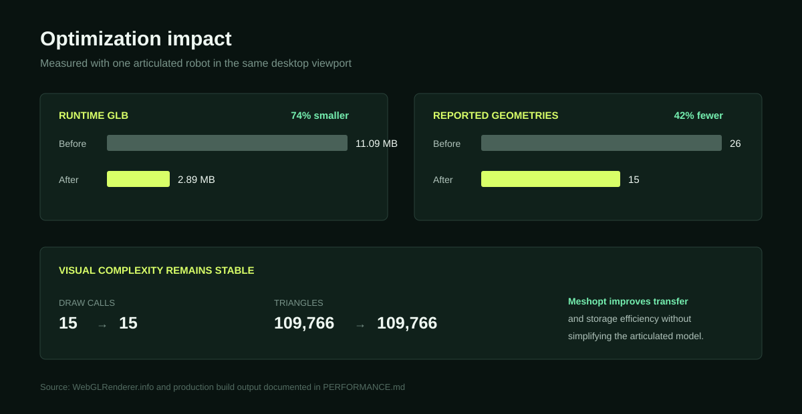
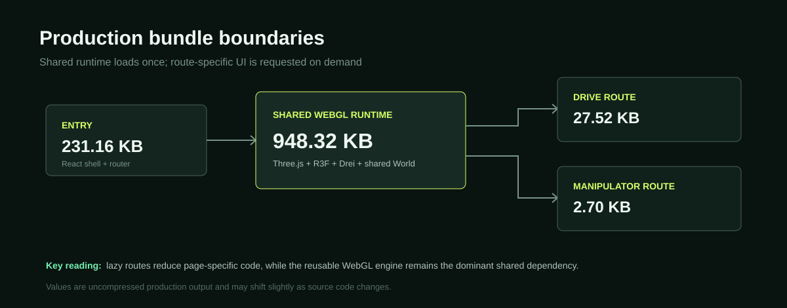

# Performance review

## Baseline

Measured on the desktop browser with one robot visible:

| Metric | Baseline |
| --- | ---: |
| Draw calls | 15 |
| Geometries | 26 |
| Triangles | 109,766 |
| JS heap | approximately 51–52 MB |
| Runtime GLB | 11.09 MB |
| Main production JS | approximately 1.28 MB before gzip |

The geometry count and triangle count come from `WebGLRenderer.info`. Heap memory is browser-specific and is available through `performance.memory` in Chromium-based browsers.

## Changes

1. Meshopt-compressed the GLB while preserving node names and the complete kinematic hierarchy. Flattening, joining, simplification, and automatic instancing are disabled intentionally.
2. Added route-level lazy loading so page-specific UI code is requested on demand.
3. Removed the runtime HDR environment request and replaced it with lightweight static lighting.
4. Capped device pixel ratio at 1.5 and requested the high-performance GPU preference.
5. Kept telemetry at 10 Hz and trajectory sampling bounded rather than coupling React state updates to every rendered frame.
6. Added live FPS and smoothed frame-time reporting for device-specific verification.

## Verified result

Measured again on the same desktop development viewport after optimization:

| Metric | Before | After | Result |
| --- | ---: | ---: | ---: |
| Runtime GLB | 11.09 MB | 2.89 MB | about 74% smaller |
| Draw calls | 15 | 15 | unchanged |
| Geometries | 26 | 15 | 42% fewer reported geometries |
| Triangles | 109,766 | 109,766 | unchanged |
| Idle FPS | not recorded in the original panel | 60 | device-specific |
| Smoothed frame time | not recorded in the original panel | 16.7 ms | device-specific |

### Visual comparison

The initial monolithic JavaScript output was approximately 1.28 MB (365 KB gzip). The current build emits an approximately 231 KB entry, 28 KB drive page, 3 KB manipulator page, and a 948 KB shared WebGL chunk. On the drive route this totals approximately 1.21 MB before gzip, with the manipulator UI loaded only when visited.

### Bundle split

The triangle and draw-call counts remain stable because Meshopt changes transfer/storage efficiency, not visual complexity. This is intentional: aggressive mesh joining or simplification could break joint transforms or visibly alter the assessment model.

The Vite output is split into route and shared chunks. The shared Three.js/React Three Fiber chunk remains large because it contains the WebGL runtime; splitting it further would mainly change caching boundaries rather than reduce downloaded code. Actual FPS, frame time, and heap depend on GPU, browser, viewport, device pixel ratio, background applications, and whether browser development tools are open; use the live renderer panel instead of claiming a universal FPS number. Heap after hot reload was not used for comparison because the development process can retain the previous module/model until garbage collection.

## Further work for a fleet-scale product

- Implement the per-link instancing strategy described in `INSTANCING.md` when multiple robots are visible.
- Add level-of-detail meshes and distance-based shadow policies.
- Move the trajectory into a fixed `BufferGeometry` if the trail needs substantially more than 1,500 samples.
- Add a repeatable browser benchmark with a fixed camera path and robot count.
